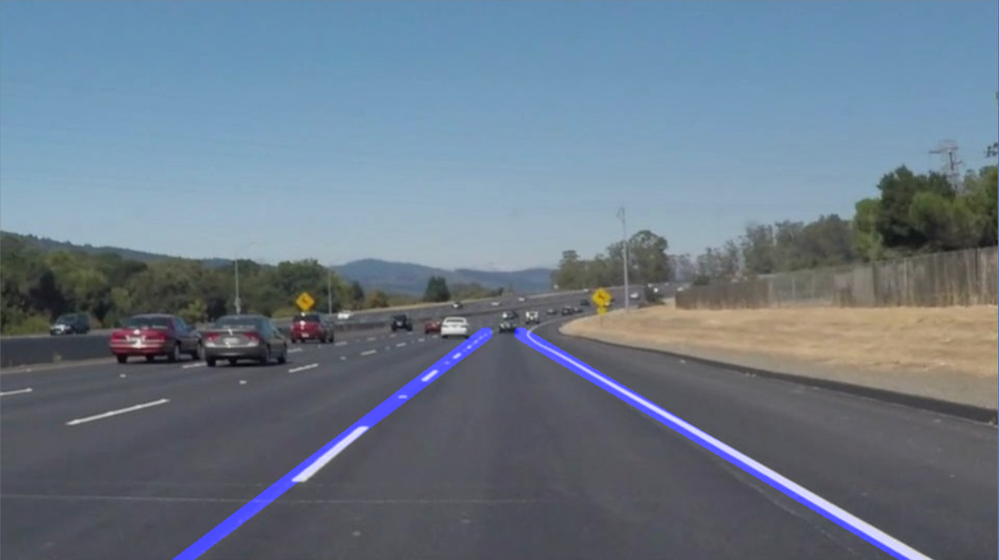
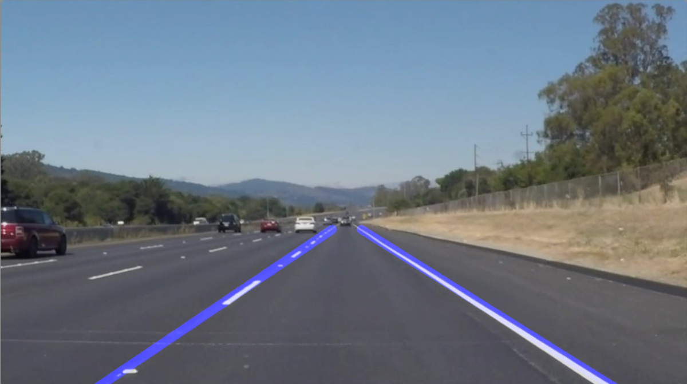
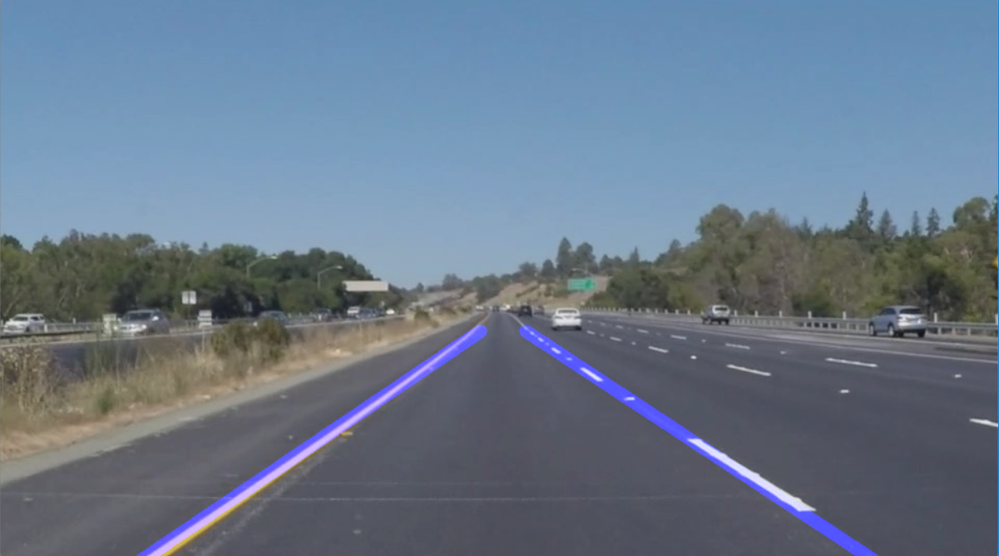

# **Finding Lane Lines on the Road** 

## Writeup Template

### You can use this file as a template for your writeup if you want to submit it as a markdown file. But feel free to use some other method and submit a pdf if you prefer.

---

**Finding Lane Lines on the Road**

The goals / steps of this project are the following:
* Make a pipeline that finds lane lines on the road
* Reflect on your work in a written report

[//]: # (Image References)

[image1]: ./write_up_files/lines_image1.png  "Example 1"
[image2]: ./write_up_files/lines_image2.png "Example 2"
[image3]: ./write_up_files/lines_image3.png "Example 3"
[image4]: ./write_up_files/lines_image4.png "Example 4"
[image5]: ./write_up_files/lines_image5.png "Example 5"
---

### Reflection

### 1. Describe your pipeline.

Here you can find some examples of the output of the algorithm:

<table cellspacing="0" cellpadding="0" border="0" width="600">
    <tr>
        <td width="580"></td>
        <td width="20"></td>
    </tr>
</table>
<table cellspacing="0" cellpadding="0" border="0" width="600">
    <tr>
        <td width="580"></td>
        <td width="20"></td>
    </tr>
</table>
The main function is **"detect_lines_on_road"** that contain the pipeline to detect the lines on the road.

The pipeline of **"detect_lines_on_road"** consisted of X main steps:

 1. Convert the image to grayscale.
 2. Apply Blur filtering to remove high frequencies.
 3. Process the Canny Filter to extract the edge of the image.  
 4. Generate the Region Of Interest (ROI) and remove edges that do not belong to the ROI.
 5. Call to the function **"hough_lines_road"** that is the core of the lines extraction.
 6. Merge of the image and the detected lines.

The implementation of the function **"hough_lines_road"** follow the steps described below:

 1. Detect the line by mean of hough transformation 
 2. Detect and identify the left and right lines by mean of the function **"detect_left_right_line"**
 3. Draw the left and right lines and draw in the image.
 
 The implementation of the function **"detect_left_right_line"** follow the steps described below:
 
 
In order to draw a single line on the left and right lanes, I modified the draw_lines() function by ...

### 2. Identify potential shortcomings with your current pipeline

One potential shortcoming would be what would happen when ... 

Another shortcoming could be ...

### 3. Suggest possible improvements to your pipeline

A possible improvement would be to ...

Another potential improvement could be to ...

