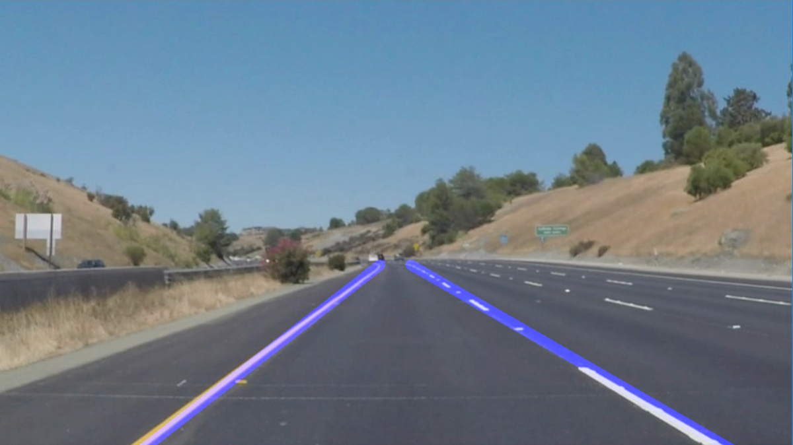
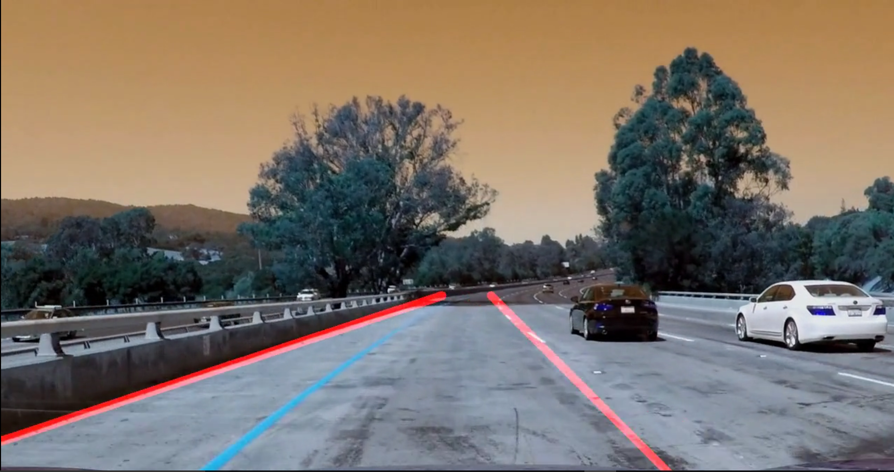
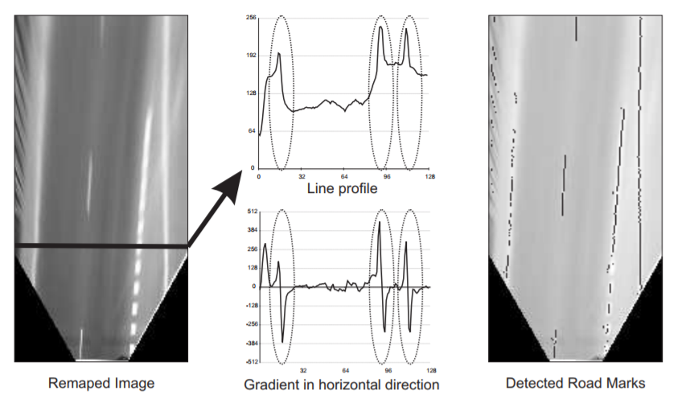

# **Finding Lane Lines on the Road** 

## Writeup File

---

**Finding Lane Lines on the Road**

The goals / steps of this project are the following:
* Make a pipeline that finds lane lines on the road
* Reflect on your work in a written report

### Reflection

### 1. Describe your pipeline.

Here you can find some examples of the output of the algorithm:

<table cellspacing="0" cellpadding="0" border="0" width="600">
    <tr>
        <td width="380"></td>
        <td width="380"></td>
    </tr>
</table>
<table cellspacing="0" cellpadding="0" border="0" width="600">
    <tr>
        <td width="380"></td>
        <td width="380"></td>
    </tr>
</table>
The main function is **"detect_lines_on_road"** that contain the pipeline to detect the lines on the road.

The pipeline of **"detect_lines_on_road"** consisted of X main steps:

 1. Convert the image to grayscale.
 2. Apply Blur filtering to remove high frequencies.
 3. Process the Canny Filter to extract the edge of the image.  
 4. Generate the Region Of Interest (ROI) and remove edges that do not belong to the ROI.
 5. Call to the function **"hough_lines_road"** that is the core of the lines extraction.
 6. Merge of the image and the detected lines.

The implementation of the function **"hough_lines_road"** follow the steps described below:

 1. Detect the line by mean of hough transformation 
 2. Detect and identify the left and right lines by mean of the function **"detect_left_right_line"**
 3. Draw the left and right lines and draw in the image.
 
 The implementation of the function **"detect_left_right_line"** follow the steps described below:
 
 1. Estimate the center of the image in X
 2. Collect in two list (left lines and right lines) by the X criteria example: if center_x>line.x add to the right_line_list and the equation of the line by mean of the two points that define the line.
 3. Once that we have to list with the left and right lines we get the one with high score by mean of the function **"get_scores"**
 4. Get the left and right lines with higher score
 5. Return left and right line
 
 The implementation of the function **"get_scores"** follow the steps described below:
 
 1. Set the score to 0 the lines that have an angle below 200º 
 2. By mean the line equation each point that relay in the line we check 5 pixels to the left and to the right and increase the score 
    if the canny image is marked with a value bigger than 0.
3. Return the scores.
  
### 2. Identify potential shortcomings with your current pipeline

Sometimes the method fail, for example in the Challenge video. The problem is that find bigger lines that don't belong to the road lane. Here one example: 

Other point is that the line is not stable, i.e., it is doing the snake effect. Also I have seen that in the challenge video sometimes the right line disappear, but this problem can be because the ROI due the other videos have different resolution.

### 3. Suggest possible improvements to your pipeline

A possible improvement would be instead of use the Canny method, it study the transition of the derivative in X and mark block when there is a zero cross in the  derivative domain. Here an example extracted from the paper **"Adaptative Road Lanes Detection and Classification"** :

Also in the paper, make use of Inverse Perspective Mapping (IPM) in order to avoid the ROI in the image, this is more portable if we
know the intrinsic and extrinsic parameters of the camera in order to generate the IPM,

Another potential improvement could be to ...

